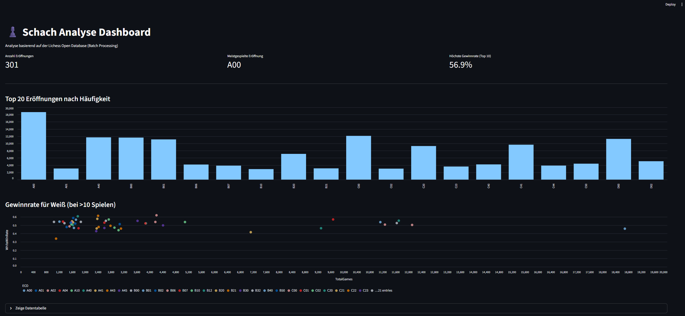

# Data Engineering Portfolio: Batch-Processing Pipeline für Schach-Analysen

Dieses Repository beinhaltet die Implementierung einer **Batch-basierten Datenarchitektur** im Rahmen des Portfolioprojekts "Data Engineering". Ziel des Projekts ist der Aufbau einer containerisierten Pipeline, die Schachpartien (PGN-Format) einliest, bereinigt, aggregiert und in einem Dashboard visualisiert.

Als Datenbasis dient die [Lichess Open Database](https://database.lichess.org/).

## 🏗️ Architektur

Die Pipeline folgt einem Microservice-Ansatz und ist vollständig in **Docker** containerisiert. Sie implementiert eine "Medallion Architecture" (Bronze/Gold Layer) innerhalb eines lokalen Data Lakes.

**Die Komponenten:**

1.  **Ingestion Service:**
    *   Liest komprimierte Rohdaten (`.pgn.zst`).
    *   Implementiert Chunking/Partitioning: Verarbeitet Daten in konfigurierbaren Batches, um den RAM-Verbrauch konstant niedrig zu halten.
    *   Extrahiert Metadaten (Elo, Eröffnung, Ergebnis) mittels `python-chess`.
    *   Speichert Rohdaten als partitionierte **Parquet**-Dateien (Bronze Layer).
2.  **Processing Service:**
    *   Wartet auf Abschluss der Ingestion.
    *   Führt Data Cleaning durch (Filterung ungültiger Partien).
    *   Aggregiert Gewinnwahrscheinlichkeiten basierend auf Eröffnungen (ECO-Codes).
    *   Speichert Ergebnisse im Gold Layer.
3.  **Dashboard Service:**
    *   Visualisiert die Ergebnisse mittels **Streamlit**.
    *   Ermöglicht explorative Datenanalyse im Browser.

---

## 🚀 Technologie-Stack

*   **Infrastructure as Code:** Docker & Docker Compose
*   **Sprache:** Python 3.11 (Slim Images)
*   **Datenformat:** Apache Parquet (Snappy Compression)
*   **Libraries:** Pandas, PyArrow, Python-Chess, Zstandard
*   **Frontend:** Streamlit

---

## 🛠️ Installation & Ausführung

Voraussetzung: **Docker Desktop** muss installiert sein und laufen.

### 1. Repository klonen
```bash
git clone https://github.com/Torim98/data-engineering-portfolio.git
cd data-engineering-portfolio
```

### 2. Testdaten herunterladen

Aus Gründen der Speicherplatzoptimierung sind die Rohdaten nicht im Repository enthalten.

1. Lade eine Beispieldatei von database.lichess.org herunter (für Tests empfehlen sich kleinere Dateien von 2013/2014).
2. Platziere die Dateien im Ordner `data/`.

Die Ordnerstruktur sollte so aussehen:

```Text
/portfolio-chess-analytics
  ├── data/
  │   └── lichess_sample1.pgn.zst
  │   └── lichess_sample2.pgn.zst
  ├── ingestion/
  ├── processing/
  ├── dashboard/
  └── docker-compose.yml
```

### 3. Pipeline starten

Führe folgenden Befehl im Hauptverzeichnis aus:

```Bash
docker compose up --build
```

### 4. Dashboard öffnen

Sobald die Pipeline durchgelaufen ist, ist das Dashboard unter folgender URL erreichbar:

👉 http://localhost:8501



---

## 💡 Engineering-Konzepte

*   **Idempotenz**: Die Pipeline ist so konzipiert, dass sie beliebig oft neu gestartet werden kann. Zieldateien werden überschrieben, sodass keine Duplikate entstehen.
*   **Skalierbarkeit (Partitioning)**: Der Ingestion-Service verarbeitet Dateien nicht "am Stück", sondern in Chunks (z.B. 10.000 Partien). Dies verhindert Memory-Overflows (OOM) und ermöglicht die Verarbeitung beliebig großer Datensätze bei konstantem RAM-Verbrauch.
*   **Reliability**: Durch `service_completed_successfully` Conditions in Docker Compose wird sichergestellt, dass Services in der korrekten Reihenfolge starten (Vermeidung von Race Conditions).
*   **Reproduzierbarkeit**: Alle Abhängigkeiten sind in `requirements.txt` fixiert und laufen in isolierten Containern.
*   **Datenschutz**: Spielernamen werden während der Ingestion verworfen (Datensparsamkeit).

---

## 📂 Projektstruktur

*   `/ingestion`: Code für den ETL-Prozess (PGN -> Parquet).
*   `/processing`: Code für Aggregation und Feature Engineering.
*   `/dashboard`: Streamlit-Applikation.
*   `/data`: Lokaler Mount für den Data Lake (wird via .gitignore exkludiert).

---

## 🔮 Ausblick: Machine Learning Integration

Die Entwicklung der eigentlichen **Machine Learning Applikation** (z. B. zur Vorhersage von Spielausgängen) war **Out of Scope** für dieses Data-Engineering-Projekt. Die Architektur ist jedoch explizit darauf ausgelegt, als Backend für ML-Workflows zu dienen.

**Wie eine Integration aussehen könnte:**

Da der *Processing Service* bereits das Data Cleaning (Filterung, Typisierung) übernimmt, kann ein Data Scientist direkt auf den **aufbereiteten Daten** aufsetzen, anstatt sich erneut mit den Rohdaten befassen zu müssen.

**Beispiel-Workflow für ein Vorhersagemodell:**

1.  **Data Loading:** Das ML-Modell lädt die bereinigten Partitionen (z. B. aus einem "Silver Layer", bevor die Daten für das Dashboard aggregiert werden).
2.  **Training:**
    ```python
    # Pseudo-Code Beispiel mit Scikit-Learn
    import pandas as pd
    from sklearn.ensemble import RandomForestClassifier

    # Zugriff auf die vom Data Engineering vorbereiteten Daten
    # (Parquet ist performant und behält Datentypen bei)
    df = pd.read_parquet('data/processed/cleaned_games')
    
    # Training des Modells auf den sauberen Features
    X = df[['WhiteElo', 'BlackElo', 'ECO_Encoded']]
    y = df['Result']
    
    model = RandomForestClassifier()
    model.fit(X, y)
    ```
3.  **Deployment:** Das trainierte Modell könnte als vierter Container (z. B. mit **FastAPI** oder **MLflow**) in die `docker-compose`-Architektur integriert werden, um Vorhersagen für neue Partien in Echtzeit bereitzustellen.

---

## 📄 Lizenz

Dieses Projekt ist unter der **MIT Lizenz** lizenziert – siehe die Datei [LICENSE](LICENSE) für Details.